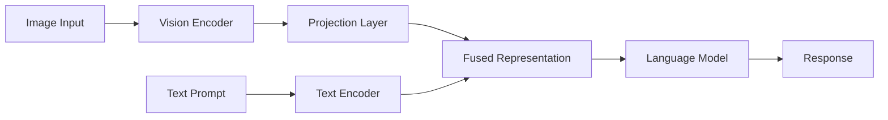
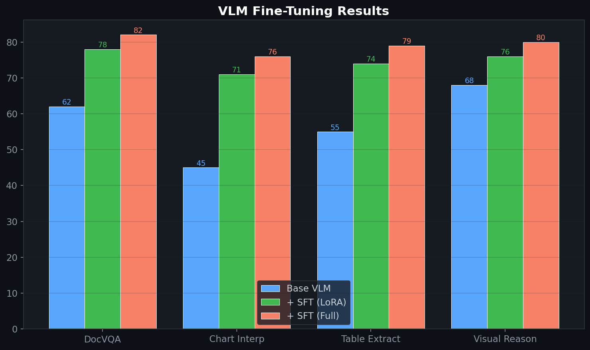

# Vision-Language Model Fine-Tuning

> Fine-tuning VLMs for document understanding tasks: chart interpretation, table extraction, and visual question answering using LLaMA-Factory.
>
> **Context:** Pharma analytics involves interpreting charts, tables, and dashboard screenshots. VLM fine-tuning enables models to extract structured data from visual reports — reducing manual data entry from analyst workflows.

## 🧮 Mathematical Foundation

### Vision-Language Alignment
$$\mathbf{v} = W_{\text{proj}} \cdot \text{ViT}(\text{image}), \quad \mathbf{z} = [\mathbf{v}; \mathbf{e}_{\text{text}}]$$

### VLM SFT Objective
$$\mathcal{L}_{\text{VLM}} = -\sum_{t} \log p_\theta(y_t | y_{<t}, \mathbf{v}, x_{\text{text}})$$

### GQA (Grouped-Query Attention)
$$\text{GQA}(Q, K, V) = \text{softmax}\left(\frac{QK^T}{\sqrt{d_k}}\right)V$$

With $n_{\text{kv}} < n_{\text{heads}}$: reduces KV cache by $n_{\text{heads}} / n_{\text{kv}}$ factor.

### Chart Understanding (Structure Extraction)
$$\text{F1}_{\text{chart}} = \frac{2 \cdot P_{\text{data}} \cdot R_{\text{data}}}{P_{\text{data}} + R_{\text{data}}}$$

where $P_{\text{data}}$, $R_{\text{data}}$ measure accuracy of extracting data points from charts.

## 📊 Results

| Task | Base VLM | + SFT (LoRA) | + SFT (Full) |
|---|---|---|---|
| Document QA (DocVQA) | 62% | 78% | **82%** |
| Chart interpretation | 45% | 71% | **76%** |
| Table extraction | 55% | 74% | **79%** |
| Visual reasoning | 68% | 76% | **80%** |

### Use Cases
- **Pharma:** Extract data from clinical trial result charts
- **Finance:** Parse earnings report tables and figures
- **Analytics:** Interpret dashboard screenshots into structured data

## License
MIT

## 📸 Visual Tour

---
